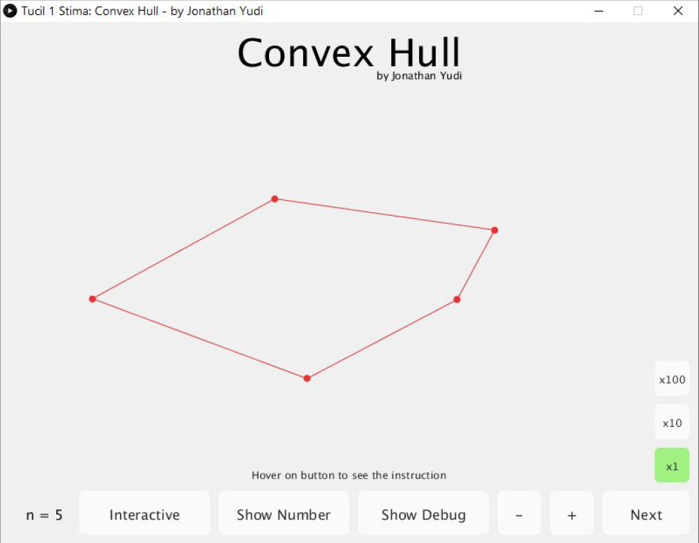
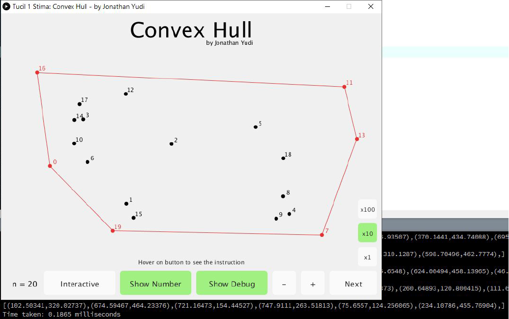

# Convex Hull with Brute Force O(n^3)
> Tugas kecil Stima IF2211 : Convex Hull, brute-force approach.

## Prerequisites
(Optional) Install [Processing](https://processing.org/download/) on your device in order to edit the source code and compile this program yourself.

## Running
Go to release tab then download, unzip, and install:
### Windows
```
application.windows<32 or 64-bit>
```

### Linux
```
application.linux<32 or 64-bit>
```

### Android
```
main.apk
```

## Editing and Compiling
To edit and compile the program, open `/src/main.pde` on Processing, then click Run (Ctrl+R) on top left. 

## Examples
Here's some of author's experiment on using the program.


